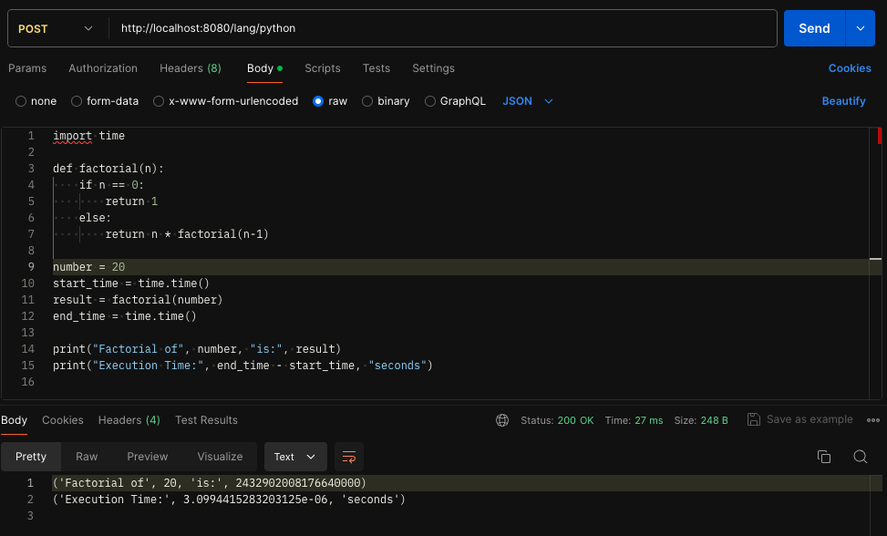
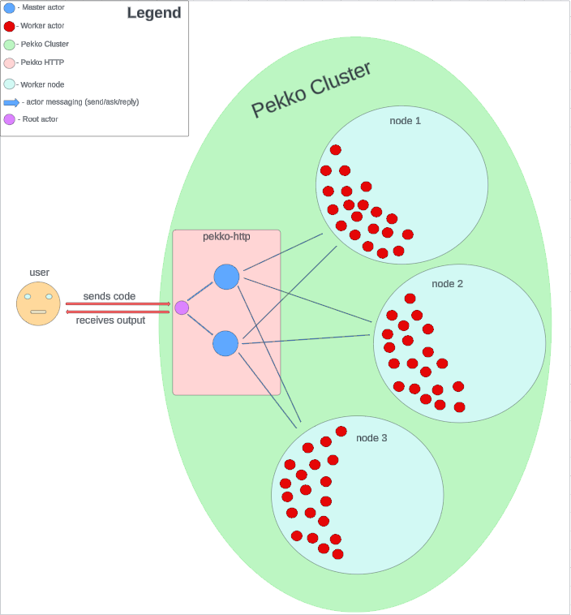

# Distributed Remote Code Execution Engine

Drill your brain, because why the heck not.

Requirements for deploying locally:
- docker engine

Running locally:
- clone the project and navigate to the root directory
- `docker-compose up`

Example:
- sending `POST` request at `localhost:8080/lang/python`
- attaching `python` code to request body



Supported programming languages:
- `Scala 3.1.1`: `localhost:8080/lang/scala`
- `Java 17`: `localhost:8080/lang/java`
- `Python 3`: `localhost:8080/lang/python`
- `JavaScript / Node 16`: `localhost:8080/lang/javascript`

Simple code snippets for testing:

- `Scala`
```scala
@main def hello(): Unit = println("drill my brain")
```

- `Java`
```java
public class BrainDrill {
    public static void main(String[] args) {
        System.out.println("drill my brain");
    }
}
```

- `Python`
```python
print("drill my brain") 
```

- `JavaScript`:
```javascript
console.log("drill my brain");
```

DONE:
- implement POC - ✅
- introduce http layer (pekko-http) - ✅
- introduce local master and worker pekko actors - ✅
- introduce Pekko Cluster - ✅
- turn local master actor into load balancer node - ✅
- create 3 worker nodes - ✅
- distribute worker actors equally on each node (e.g 25 actors on each node, awaiting tasks) - ✅
- run cluster via docker-compose - ✅ 
- implement timeouts & cleanup for long-running code, limit CPU and RAM, add secure layer - ✅

TODO:
- write load tests to check how system behaves during high load - ❌
- add support for C, C++, Go and others - ❌
- use other `pekko` libraries to make cluster bootstrapping and management flexible and configurable - ❌
- wrap the cluster in k8s and enable autoscaling - ❌
- deploy two separate clusters and enable `RoundRobin` load balancing via k8s - ❌

Architecture Diagram:

