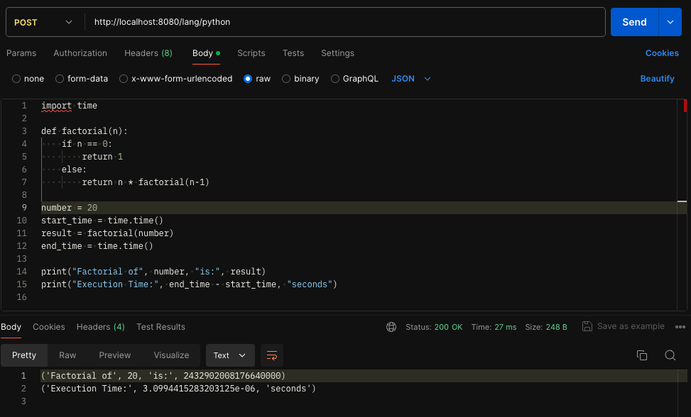

# Distributed Remote Code Execution Engine

Send code, we will run it :)

Blog version: https://blog.rockthejvm.com/remote-code-execution-engine/ 

Video demo: https://www.youtube.com/watch?v=sMlJC7Kr330

Requirements for deploying locally:
- docker engine

Running locally (startup may be slow for the first time since it needs to pull a few docker images):
- clone the project and navigate to the root directory
- start the docker engine
- `chmod +x deploy.sh`
- `./deploy.sh`

In case you change code and want to run the new version you should execute:
- `./deploy.sh rebuild`

Example:
- sending `POST` request at `localhost:8080/lang/python`
- attaching `python` code to request body



Supported programming languages, HTTP paths and simple code snippets for request body, respectively:
- `Java` - `localhost:8080/lang/java`
```java
public class BrainDrill {
    public static void main(String[] args) {
        System.out.println("drill my brain");
    }
}
```

- `Python` - `localhost:8080/lang/python`
```python
print("drill my brain") 
```

- `Ruby` - `localhost:8080/lang/ruby`
```ruby
puts "drill my brain" 
```

- `Perl` - `localhost:8080/lang/perl`
```perl
print "drill my brain\n"; 
```

- `JavaScript` - `localhost:8080/lang/javascript`
```javascript
console.log("drill my brain");
```

- `PHP` - `localhost:8080/lang/php`
```javascript
<?php
echo "drill my brain";
?>
```

Architecture Diagram:


TODO:
- add support for C, Go, Rust and others - ❌
- use other `pekko` libraries to make cluster bootstrapping and management flexible and configurable - ❌
- wrap the cluster in k8s and enable autoscaling - ❌
